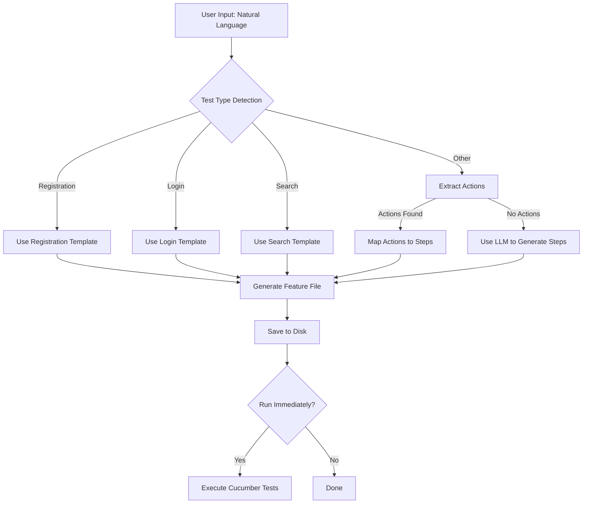
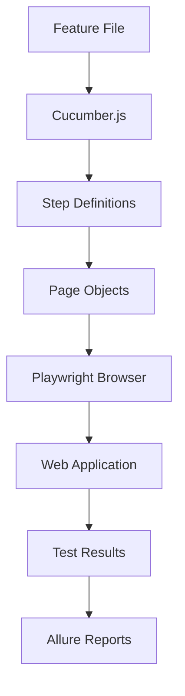
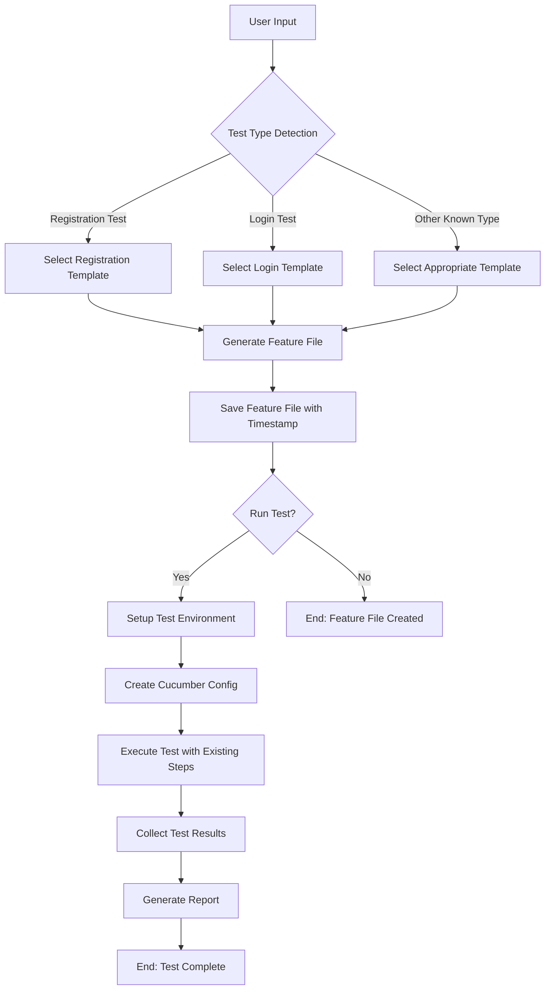
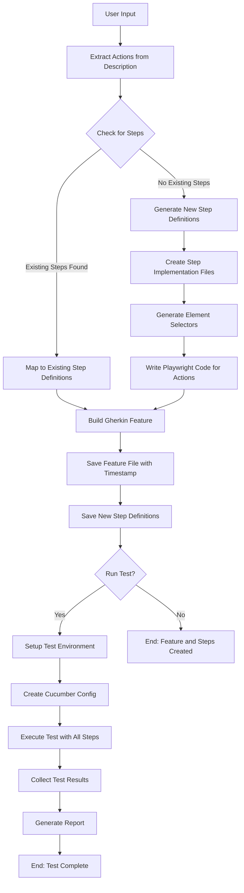
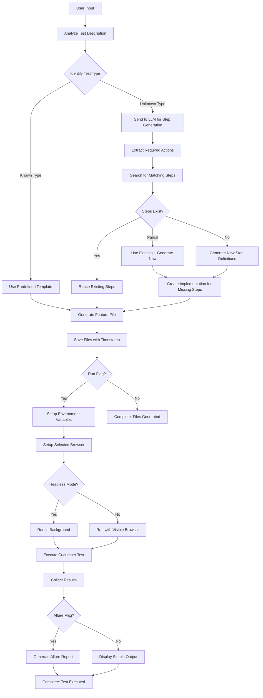

# QA Alchemist

QA Alchemist is an AI-powered test automation framework that allows you to generate and execute Cucumber/Gherkin tests from natural language descriptions.

## Overview

The system uses OpenAI's GPT models to convert natural language test descriptions into structured Cucumber feature files. These feature files are then executable with Playwright and Cucumber.js, providing a complete end-to-end testing solution.

## Architecture

```
┌──────────────────┐     ┌──────────────────┐     ┌──────────────────┐
│                  │     │                  │     │                  │
│  Natural         │     │  AI-Powered      │     │  Cucumber &      │
│  Language        │──-->│  Test            │──-->│  Playwright      │
│  Description     │     │  Generator       │     │  Execution       │
│                  │     │                  │     │                  │
└──────────────────┘     └──────────────────┘     └──────────────────┘
```

### Core Components

1. **Test Generation Module** (`src/ai/`)
   - `services/`: Contains the LLM service for OpenAI integration
   - `mappers/`: Maps natural language to actions and step definitions
   - `generators/`: Generates feature files from descriptions
   - `templates/`: Contains prompt templates for GPT
   - `cli/`: Command-line interface for the generator

2. **Test Execution Module**
   - Cucumber.js for running the tests
   - Playwright for browser automation
   - Allure for reporting

## Generation Workflow



The workflow consists of these steps:

1. **User Input**: User provides a natural language description of the test scenario.

2. **Test Type Detection**: The system analyzes the description to identify the test type (registration, login, search, etc.).

3. **Template Selection**: 
   - For known test types (registration, login), specialized templates with verified step definitions are used.
   - For custom tests, the system either extracts actions from the description or uses the LLM to generate steps.

4. **Feature Generation**: A complete Gherkin feature file is generated with:
   - Appropriate tags
   - Feature title and description
   - One or more scenarios with Given/When/Then steps

5. **Test Execution** (optional): If the `--run` flag is provided, the system executes the generated test immediately using Cucumber.js and Playwright.

## Execution Workflow



The execution workflow:

1. Cucumber.js reads the feature file
2. Step definitions map Gherkin steps to code
3. Page objects encapsulate app-specific actions
4. Playwright drives the browser
5. Results are collected and reported through Allure

## Usage

### Basic Usage

Generate a test without running it:

```bash
./run-test.sh "User should be able to register an account"
```

Generate and immediately run a test:

```bash
./run-test.sh --run "User should be able to register an account"
```

Generate a test with Allure reporting:

```bash
./run-test.sh --allure --run "User should be able to register an account"
```

Run a test with visible browser (non-headless mode):

```bash
./run-test.sh --run --visible "User should be able to register an account"
```

### Command Line Options

| Option | Short | Description |
|--------|-------|-------------|
| `--run` | `-r` | Run the test immediately after generation |
| `--allure` | `-a` | Generate Allure reports after test execution |
| `--visible` | `-s` | Run tests with a visible browser (non-headless) |
| `--browser <type>` | `-b <type>` | Select browser: chromium, firefox, or webkit |
| `--verbose` | `-v` | Show detailed debug information during execution |

### Using npm Scripts

```bash
# Generate a test without running
npm run test:generate "User should be able to register an account"

# Generate and run immediately
npm run test:generate:run "User should be able to register an account"

# Generate and run with visible browser
npm run test:generate:run -- --visible "User should be able to register an account"

# Run with Firefox browser
npm run test:generate:run -- --browser firefox "User should be able to register an account"

# Run with visible Firefox browser and Allure reporting
npm run test:generate:run -- --visible --browser firefox --allure "User should be able to register an account"

# Run a previously generated test
npm run run-custom-test -- features/ai-generated/user_registration_2025-03-28T14-17-13-117Z.feature

# Run a previously generated test with Allure reporting
npm run run-custom-test -- --profile allure features/ai-generated/user_registration_2025-03-28T14-17-13-117Z.feature
```

## Allure Reporting

The framework includes integrated Allure reporting to provide detailed test results, including:

- Test execution statistics
- Step-by-step execution details
- Screenshots of failed tests
- Video recordings (when enabled)
- Execution environment details

### Viewing Reports

After running tests with the `--allure` flag, reports are automatically generated and opened in your default browser. You can also manually generate and view reports:

```bash
# Generate Allure report from test results
npm run allure:generate

# Open Allure report in browser
npm run allure:open
```

### Report Location

Allure reports are saved to:
```
test-results/allure-report/
```

Raw report data is stored in:
```
allure-results/
```

## Environment Configuration

The system requires an OpenAI API key in a `.env` file in the project root:

```
OPENAI_API_KEY=your_api_key_here
```

Other environment variables that can be configured:

- `BROWSER`: Browser to use (chromium, firefox, webkit)
- `HEADLESS`: Whether to run in headless mode (true, false)
- `TEST_ENV`: Environment to test (testdev1, testdev2)
- `RECORD_VIDEO`: Whether to record video (true, false)

## Directory Structure

```
├── app/
│   ├── features/
│   │   └── ai-generated/      # Generated feature files
│   ├── src/
│   │   ├── ai/                # AI test generation module
│   │   │   ├── cli/           # Command-line interface
│   │   │   ├── generators/    # Feature generators
│   │   │   ├── mappers/       # Action & step mappers
│   │   │   ├── services/      # LLM service
│   │   │   └── templates/     # Prompt templates
│   │   ├── pages/             # Page objects
│   │   ├── step-definitions/  # Cucumber step definitions
│   │   └── utils/             # Utility functions
│   ├── cucumber.js            # Main Cucumber configuration
│   ├── cucumber.custom.js     # Configuration for AI-generated tests
│   ├── package.json           # npm dependencies
│   └── run-test.sh            # Test runner script
└── .env                       # Environment variables
```

## Cucumber Configuration

The system uses several Cucumber configuration files:

1. **`cucumber.js`**: The main configuration for running standard tests. It includes profile settings for Allure reporting.

2. **`cucumber.custom.js`**: Used for running AI-generated tests. It includes paths to both standard and AI-generated step definitions and looks for feature files in the `features/ai-generated/` directory.

3. **`cucumber.ai-test.js`**: A temporary configuration file created when running a test immediately after generation. It's configured to run a specific feature file and is deleted after execution.

### Example: cucumber.custom.js

```javascript
module.exports = {
    default: {
        requireModule: ['ts-node/register'],
        require: [
            'src/**/hooks.ts',
            'src/**/world.ts',
            'src/**/*.steps.ts',
            'src/step-definitions/ai-generated/**/*.steps.ts'
        ],
        paths: ['features/ai-generated/*.feature'],
        format: [
            'progress-bar',
            '@cucumber/pretty-formatter'
        ]
    }
};
```

## Extension Points

The system can be extended in several ways:

1. **New Templates**: Add new test templates for specific scenarios in `src/ai/templates/`
2. **Custom Actions**: Extend the `ActionMapper` to handle more complex actions
3. **Additional Page Objects**: Create new page objects for different parts of the application
4. **Custom Step Definitions**: Add new step definitions for application-specific actions

## Technical Stack

- **Node.js**: Runtime environment
- **TypeScript**: Programming language
- **OpenAI API**: For AI-powered test generation
- **Cucumber.js**: BDD test framework
- **Playwright**: Browser automation
- **Allure**: Test reporting

# Firefox + visible + Allure reporting
./run-test.sh --run --browser firefox --visible --allure "User should be able to register an account"

## AI Test Generation Workflows

### Workflow 1: Using Existing Steps

When generating tests for functionality that already has step definitions:



### Workflow 2: Creating New Steps

When generating tests for functionality that doesn't have existing step definitions:



### Detailed Process Flow

The complete end-to-end process with all decision points:

