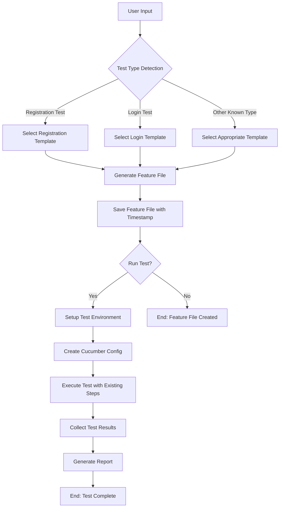
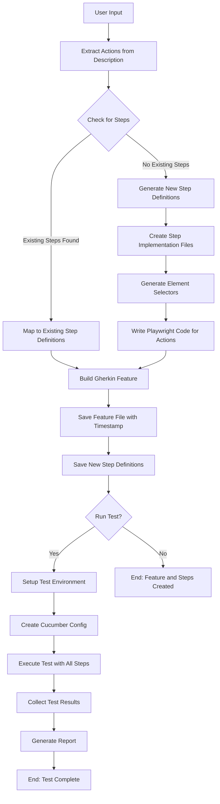
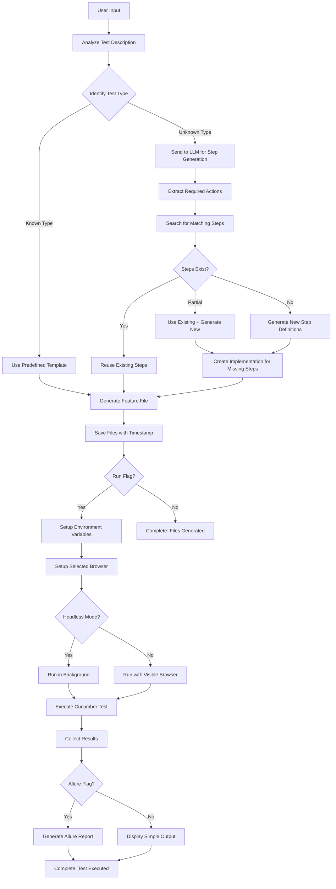

# Test Generation Flow Diagrams

## Flow 1: When Steps Already Exist

```mermaid
flowchart TD
    Start[User Input] --> TypeDetect{Test Type Detection}
    TypeDetect -->|Registration Test| TemplateSelect[Select Registration Template]
    TypeDetect -->|Login Test| LoginTemplate[Select Login Template]
    TypeDetect -->|Other Known Type| OtherTemplate[Select Appropriate Template]
    
    TemplateSelect --> FeatureGen[Generate Feature File]
    LoginTemplate --> FeatureGen
    OtherTemplate --> FeatureGen
    
    FeatureGen --> SaveFeature[Save Feature File with Timestamp]
    SaveFeature --> RunCheck{Run Test?}
    
    RunCheck -->|Yes| SetupEnv[Setup Test Environment]
    RunCheck -->|No| End[End: Feature File Created]
    
    SetupEnv --> ConfigCucumber[Create Cucumber Config]
    ConfigCucumber --> RunTest[Execute Test with Existing Steps]
    RunTest --> CollectResults[Collect Test Results]
    CollectResults --> GenerateReport[Generate Report]
    GenerateReport --> End2[End: Test Complete]
```

## Flow 2: When Steps Don't Exist

```mermaid
flowchart TD
    Start[User Input] --> ActionExtract[Extract Actions from Description]
    ActionExtract --> StepCheck{Check for Steps}
    
    StepCheck -->|Existing Steps Found| MapToExisting[Map to Existing Step Definitions]
    StepCheck -->|No Existing Steps| GenerateNew[Generate New Step Definitions]
    
    GenerateNew --> CreateImplementation[Create Step Implementation Files]
    CreateImplementation --> SelectorGen[Generate Element Selectors]
    SelectorGen --> ActionCode[Write Playwright Code for Actions]
    
    MapToExisting --> BuildGherkin[Build Gherkin Feature]
    ActionCode --> BuildGherkin
    
    BuildGherkin --> SaveFeature[Save Feature File with Timestamp]
    SaveFeature --> SaveSteps[Save New Step Definitions]
    SaveSteps --> RunCheck{Run Test?}
    
    RunCheck -->|Yes| SetupEnv[Setup Test Environment]
    RunCheck -->|No| End[End: Feature and Steps Created]
    
    SetupEnv --> ConfigCucumber[Create Cucumber Config]
    ConfigCucumber --> RunTest[Execute Test with All Steps]
    RunTest --> CollectResults[Collect Test Results]
    CollectResults --> GenerateReport[Generate Report]
    GenerateReport --> End2[End: Test Complete]
```

## Detailed Process Flow

```mermaid
flowchart TB
    UserInput[User Input] --> Analyze[Analyze Test Description]
    Analyze --> TypeIdentify{Identify Test Type}
    
    TypeIdentify -->|Known Type| Template[Use Predefined Template]
    TypeIdentify -->|Unknown Type| LLM[Send to LLM for Step Generation]
    
    Template --> FeatureFile[Generate Feature File]
    LLM --> ActionExtract[Extract Required Actions]
    ActionExtract --> StepSearch[Search for Matching Steps]
    
    StepSearch --> StepCheck{Steps Exist?}
    StepCheck -->|Yes| ReuseSteps[Reuse Existing Steps]
    StepCheck -->|Partial| HybridApproach[Use Existing + Generate New]
    StepCheck -->|No| NewSteps[Generate New Step Definitions]
    
    ReuseSteps --> FeatureFile
    HybridApproach --> StepImpl[Create Implementation for Missing Steps]
    NewSteps --> StepImpl
    
    StepImpl --> FeatureFile
    FeatureFile --> Save[Save Files with Timestamp]
    
    Save --> RunFlag{Run Flag?}
    RunFlag -->|Yes| EnvSetup[Setup Environment Variables]
    RunFlag -->|No| Complete[Complete: Files Generated]
    
    EnvSetup --> BrowserSetup[Setup Selected Browser]
    BrowserSetup --> HeadlessCheck{Headless Mode?}
    HeadlessCheck -->|Yes| InvisibleRun[Run in Background]
    HeadlessCheck -->|No| VisibleRun[Run with Visible Browser]
    
    InvisibleRun --> ExecuteTest[Execute Cucumber Test]
    VisibleRun --> ExecuteTest
    
    ExecuteTest --> Results[Collect Results]
    Results --> AllureCheck{Allure Flag?}
    AllureCheck -->|Yes| AllureReport[Generate Allure Report]
    AllureCheck -->|No| SimpleOutput[Display Simple Output]
    
    AllureReport --> TestComplete[Complete: Test Executed]
    SimpleOutput --> TestComplete
``` 